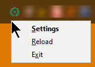
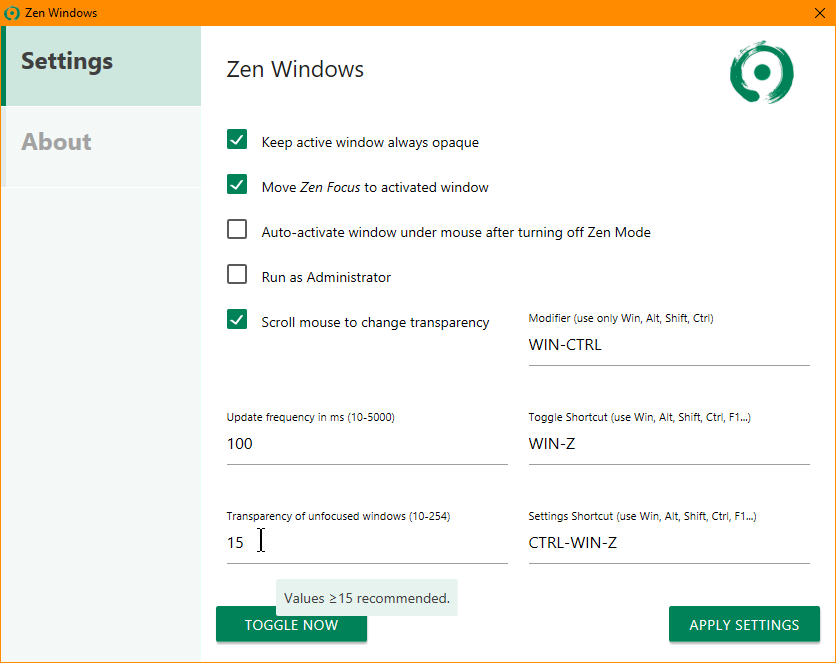
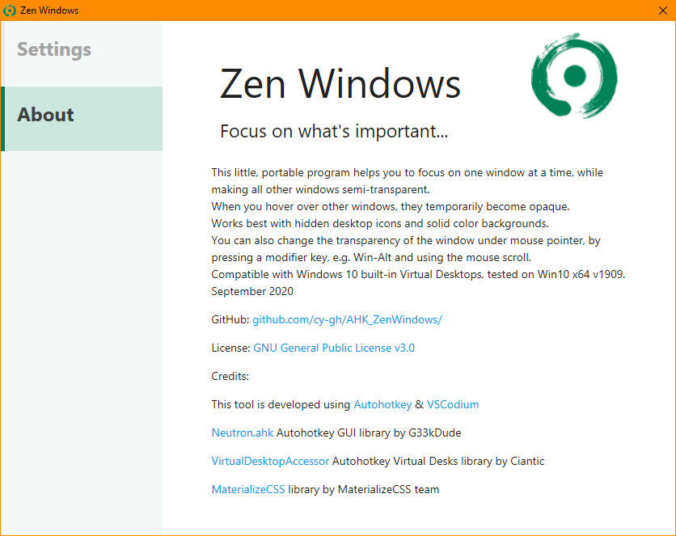

# Zen Windows

## What It Does

This little, portable program helps you to focus on one window at a time, while making all other windows semi-transparent. When you hover over other windows, they temporarily become opaque.

You can also change the transparency of the window under mouse pointer, by pressing a modifier key, e.g. Win-Alt and using the mouse scroll.

When started, you can use the tray menu to open settings, reload or exit. It is completely portable.

Works best with hidden desktop icons and solid color backgrounds.

Compatible with Windows 10 built-in Virtual Desktops, tested on Win10 x64 v1909.

*Tip:* A program crash is very unlikely but if any window gets stuck at semi-transparent state for any reason, press Toggle shortcut again, and all windows will be reset. Alternatively you can use mouse scroll feature.

September 2020

GitHub: https://github.com/cy-gh/AHK_ZenWindows/

## Screenshots







## Demo


https://github.com/cy-gh/AHK_ZenWindows/assets/71272476/effae93d-a001-47ac-b014-2b0be41de8ae


## Options

*Hint:* All options have tooltips which explain their function in detail.

## Keys Reference

Programming a hotkey recognizing feature was not on the scope, you must type the keys in the settings screen.

Below is a small reference of keys and modifiers; you can use anything from [the full reference](https://www.autohotkey.com/docs/KeyList.htm) without the curly braces but with a dash, i.e. if you fancy {Win}{Home}, use Win-Home. **Keys in the settings window are case-insensitive**, i.e. to use Win-Ctrl-F8, you can use wIn-CtRl-f8.

*Note:* normally AHK is very, very good at overriding shortcuts from other programs, even standard Windows ones like Win-E, etc. but some combinations might still not work on every system. As soon as you end the program (via Tray Menu), all shortcut will be handled by their previous *owner*s.

### Modifiers

Control, Ctrl, LControl, LCtrl, RControl, RCtrl

Alt, LAlt, RAlt

Shift, LShift, RShift

Win, LWin, RWin

### Keys

A..Z, 0..9, F1..F24, Numpad0..Numpad9, NumpadDot, NumpadEnter, NumpadMult, NumpadDiv, NumpadAdd, NumpadSub, PrintScreen, CtrlBreak, Pause, Browser_Back, Browser_Forward, Browser_Refresh, Browser_Stop, Browser_Search, Browser_Favorites, Browser_Home, Volume_Mute, Volume_Down, Volume_Up, Media_Next, Media_Prev, Media_Stop, Media_Play_Pause, Launch_Mail, Launch_Media, Launch_App1, Launch_App2, as well as special characters: !$%&/()#+-,. etc.

## Requirements

Compatible with Windows 10 built-in Virtual Desktops, tested on Win10 x64 v1909.

Windows 7 support is **not** planned but it seems to work, leaving the .ini file as the only configuration possibility. You have to remove all VDesk and GUI features first and recompile it. Afterwards you probably have to adjust Windows' standard shell classes for Alt-Tab screen, start menu, etc.

## Miscellaneous

The gigantic ASCII figlets in the source code are just for VSCode/VSCodium minimap, generated by [TextArt.io ASCII Text Generator](https://textart.io/figlet).

When a started, the VirtualDesktopAccessor's DLL file is copied under the user's %TEMP directory. It can be deleted safely after the program is closed.

If you use VSCode/VSCodium and Codemap Explorer, these are the settings I use:

```json
"ahk": [
  {
    "pattern": "^\\s*class \\w*",
    "icon": "class",
    "clear": "class",
    "regex": {}
  },
  {
    "pattern": "\\b(?!(if|If)\\b)[\\$a-zA-Z_]+?\\s*\\([^\\)]*\\)(?:\\s*\\{)",
    "icon": "function",
    "clear": "{",
    "regex": {}
  }
]
```


## License

GNU General Public License v3.0 - https://www.gnu.org/licenses/gpl-3.0.en.html


## Credits

This tool is developed using [Autohotkey](https://www.autohotkey.com/) & [VSCodium Portable](https://portapps.io/app/vscodium-portable/)

[Neutron.ahk](https://github.com/g33kdude/Neutron.ahk) AHK GUI library by G33kDude

[VirtualDesktopAccessor](https://github.com/Ciantic/VirtualDesktopAccessor) AHK Virtual Desks library by Ciantic (DLL renamed to )

[MaterializeCSS](https://materializecss.com/) library by MaterializeCSS team
